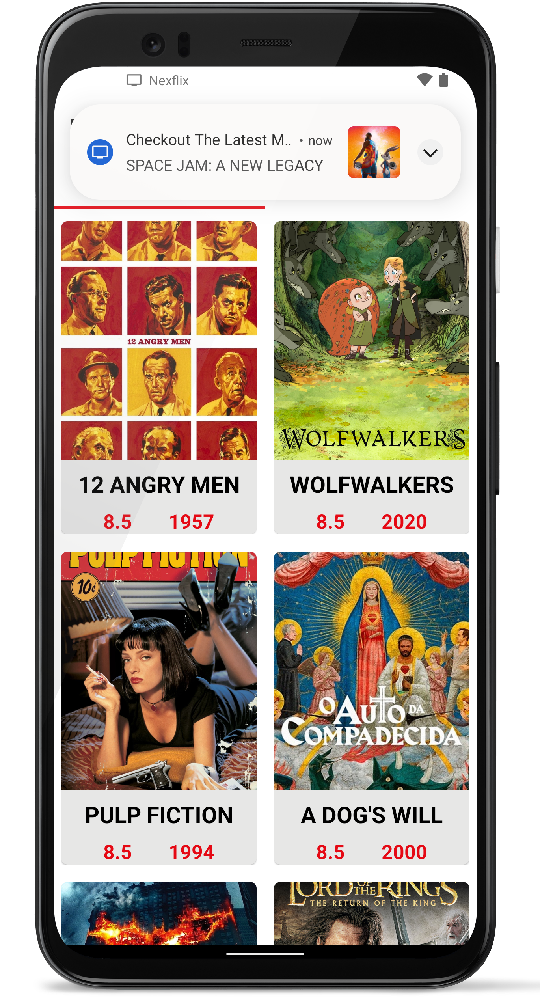
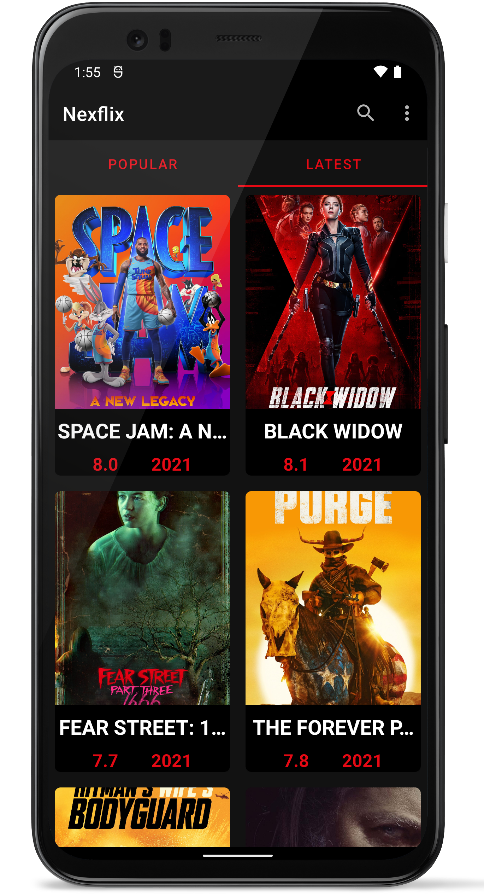
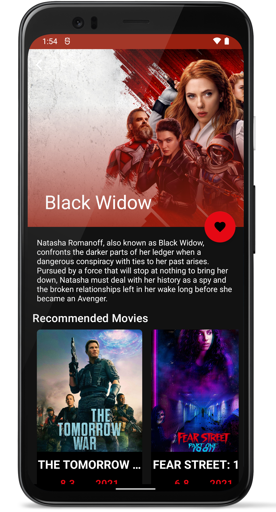
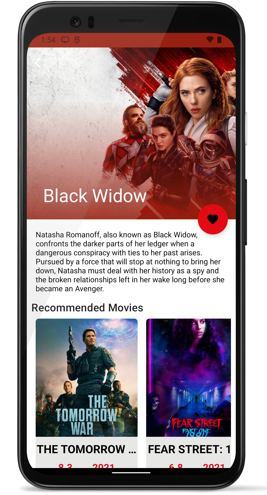
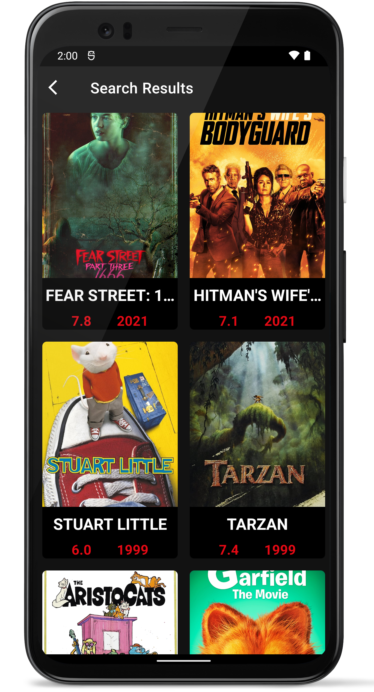
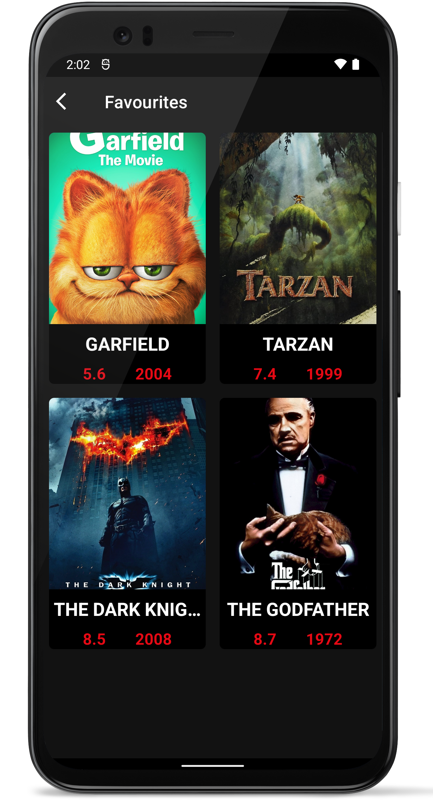

# Nexflix 🚧 under development 🚧 

An Android app that displays top and trending movies consuming [themoviedb](https://www.themoviedb.org/documentation/api) api. 
Built using architecture components, MVVM and repository pattern as practice for the AAD certification.

## Installation

1. Get a free TMDb API Key from [here](https://www.themoviedb.org/documentation/api)
2. Clone the repository onto your local machine.
3. Use your API key in the gradle buildconfig.
4. Build and run the app.

## Architecture

The project is built using Model-View-ViewModel Architecture [MVVM](https://en.wikipedia.org/wiki/Model%E2%80%93view%E2%80%93viewmodel) 
MVVM is a software architectural pattern which helps to cleanly separate the business and presentation logic of an application from its user interface.

## Technologies Used

- [Jetpack](https://developer.android.com/jetpack)
  - [Android KTX](https://developer.android.com/kotlin/ktx.html) - Provide concise, idiomatic Kotlin to Jetpack and Android platform APIs.
  - [AndroidX](https://developer.android.com/jetpack/androidx) - Major improvement to the original Android [Support Library](https://developer.android.com/topic/libraries/support-library/index), which is no longer maintained.
  - [Lifecycle](https://developer.android.com/topic/libraries/architecture/lifecycle) - Perform actions in response to a change in the lifecycle status of another component, such as activities and fragments.
  - [LiveData](https://developer.android.com/topic/libraries/architecture/livedata) - Lifecycle-aware, meaning it respects the lifecycle of other app components, such as activities, fragments, or services.
  - [ViewModel](https://developer.android.com/topic/libraries/architecture/viewmodel) - Designed to store and manage UI-related data in a lifecycle conscious way. The ViewModel class allows data to survive configuration changes such as screen rotations.
  - [Data Binding](https://developer.android.com/topic/libraries/data-binding/) - Allows you to bind UI components in your layouts to data sources in your app using a declarative format rather than programmatically.
  - [Room](https://developer.android.com/training/data-storage/room) - Provides an abstraction layer over SQLite used for offline data caching.
  - [Navigation Component](https://developer.android.com/guide/navigation/navigation-getting-started) -Component that allows easier implementation of navigation from simple button clicks to more complex patterns.
  - [WorkManager](https://developer.android.com/topic/libraries/architecture/workmanager) - An API that makes it easy to schedule reliable, asynchronous tasks that are expected to run even if the app exits or the device restarts. 

- [Kotlin Coroutines](https://developer.android.com/kotlin/coroutines) - A Kotlin feature that converts async callbacks for long-running tasks, such as database or network access, into sequential code.
- [Koin](https://insert-koin.io/) - A pragmatic lightweight dependency injection framework for Kotlin.
- [Material Design](https://material.io/) - A design system created by Google to help teams build high-quality digital experiences for Android, iOS, Flutter, and the web.
- [Retrofit](https://square.github.io/retrofit/) - Type-safe http client and supports coroutines out of the box.
- [Moshi](https://github.com/square/moshi) Moshi is a modern JSON library for Android and Java. It makes it easy to parse JSON into Java objects:
- [okhttp](https://square.github.io/okhttp/) - An efficient HTTP & HTTP/2 client for Android and Java applications.
- [Glide](https://github.com/bumptech/glide) - An image loading and caching library for Android focused on smooth scrolling

## Demo

      
  